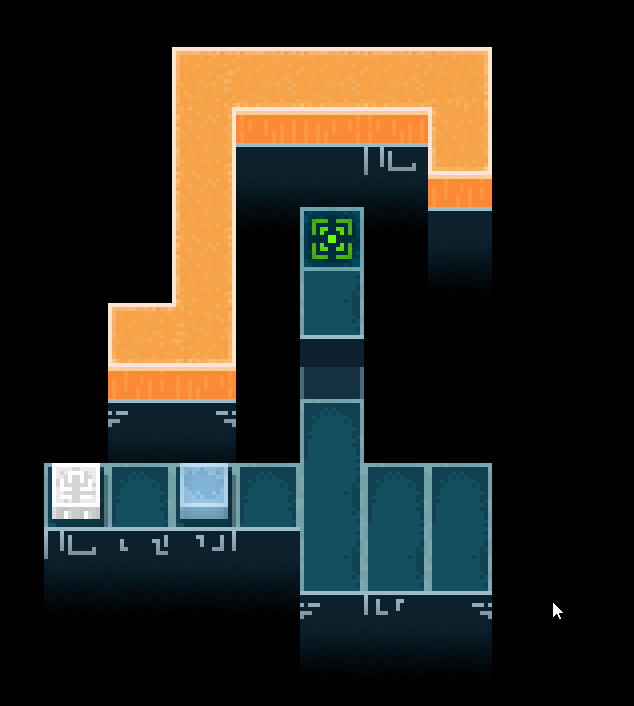
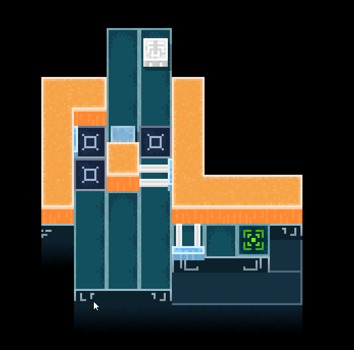
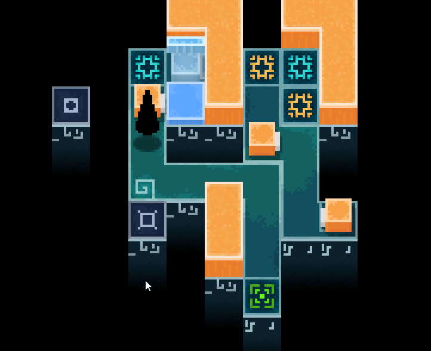
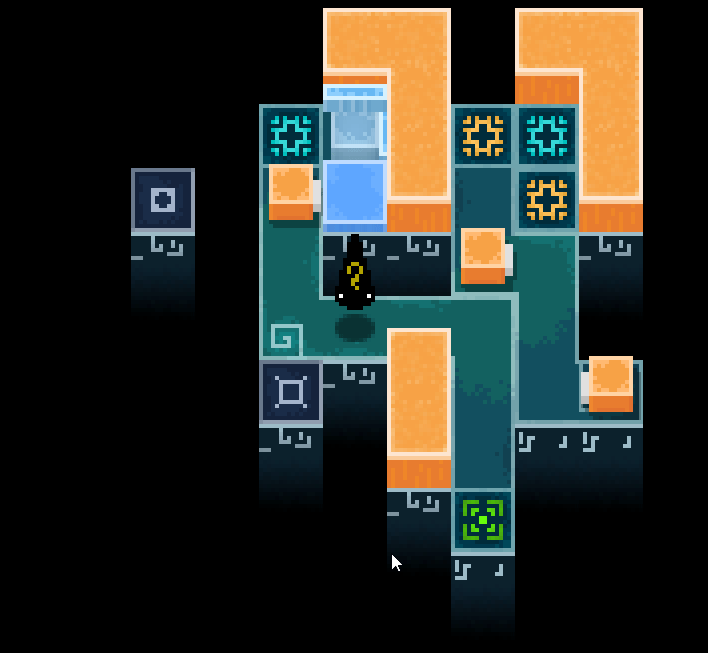
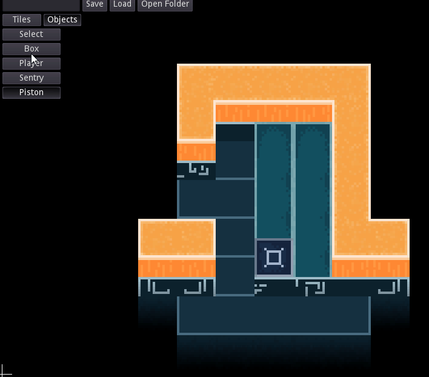

## Game
A simple Sokoban styled game...  
  

### Weight Pads and Pistons
  

### The game supports complex game logic
  

#### What's happening here?
Okay, there's a lot going on in this gif. It's meant to be one of the later levels in the game after the player has a good understanding of the mechanics, but here is a quick explanation.
The piston-like objects have an associated weight-pad with them. The one below where the player starts extends the right piston. The one isolated on the left retracts the top piston. Because the weight pad is inaccessible, the top piston is constantly trying to extend, but it can't do so, as there is first a box, and second a piston in the way. Finally, when these two move out of the way, it extends.
Secondly, there are sentries. These break boxes and players in the direction they are facing.
Third, there are teleporters. They are linked by color, and when you go through one, you go through pushing in the same direction you entered it. First, the sentry is pushed through the blue teleporter going up. Second, the box is pushed through the blue teleporter going left, pushing the sentry on the right blue teleporter to the left, where it lands on the teleporter, moving down. Because this is in one step, it does not have time to destroy the box that pushed it. Third, a sentry is pushed up, breaking the box.  

### And undoing
  
#### What's happening here?
A similar move set to the previous gif is applied. Then, this set of moves is undone with a keybind without logic errors like the one way "gate" created by the isolated weightpad and top piston.

## Map Editor
### The game has a map editor for quick creation of tiles
  

### As well as objects
  

### Save/Load
Levels can be saved and loaded quickly.

## Steps to Release
In order to finish this project and release it, it would require at least a couple solid weeks of polishing. Given my interest in more technical things, and the fact that I'm finishing up University and on a job hunt, I'm not planning on taking those weeks in the immediate future. Despite this, the game is close to feature-complete.